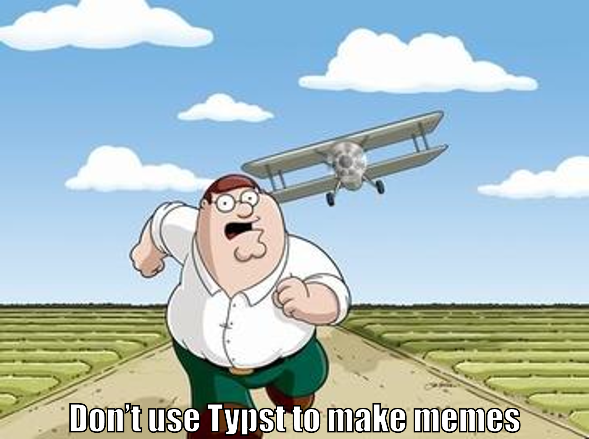

+++
title = "Making Memes with Typst"
date = 2025-07-19
[taxonomies]
tags=["Programming", "Typst"]
+++

I've been having fun using [Typst](https://typst.app/) to make various documents, and the thought struck me that I should try making a meme with it.

## Code:

```typst
#set page(width: auto, height: auto, margin: 0pt)
#set text(48pt, font: "Impact", fill: white, stroke: (paint: black, thickness: 2pt))

#image("griffin.jpg", width: 800pt)

#place(
  center + bottom,
  dy: -10pt,
  [Don't use Typst to make memes],
)
```

## Command:

```shell
typst compile meme.typ --format png
```

## Output: 


