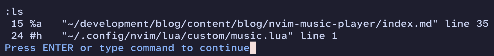

+++
title = "Integrating a Music Player into NeoVim"
date = 2025-03-27
[taxonomies]
tags=["NeoVim", "Lua", "Programming"]
+++

A while back, I wanted to start listening to my music playlist from the terminal (as one does).
So, I looked around for different music [TUIs](https://en.wikipedia.org/wiki/Text-based_user_interface) and I eventually found [mpv](https://mpv.io/).
I enjoy using `mpv`, but I wondered if there could be a way to integrate it in my NeoVim setup.
The answer, as it usually is with NeoVim, is yes you can, but you probably shouldn't.

I think my NeoVim config is set up in a fairly standard way, but I haven't read through other people's configs to confirm that.
I have a `lua/` folder in the root of my config (which lives in `~/.config/nvim/`).
Then I have a `lua/custom/` folder where I stash any scripts or helpers I am working on.
So I decided to place my new music player integration in that folder to keep everything organized.

```lua
-- lua/custom/music.lua
local M = {}
```

This is a trick I learned from [teej_dv](https://www.youtube.com/@teej_dv) and is a fairly standard way of defining modules in Lua as far as I know.
Basically you define a local table `M`, add a bunch of methods onto it, then you can return `M` at the end so other files can use your module like `require(...).whatever()`.

Before we go any further, we need to talk a little bit about how NeoVim works.
NeoVim works on the concept of buffers.
A buffer is, on a very abstract level, just a collection of text on which NeoVim can run lots of different operations, like inserting whatever characters you type when you are in insert mode.
So for every file you open, NeoVim will load that file into a buffer.
But it won't automatically delete that buffer after you load into a different file.
NeoVim keeps these buffers around in the background.
If you want to list all your current buffers, you can run `:ls`



Another important thing to know about NeoVim is that it has a terminal mode where you can run a terminal emulator inside of the editor.
When you run the `:term` command, NeoVim will spawn a new instance of your `$SHELL`, and hook up its I/O to a new buffer.
We can <s>ab</s>use that to our advantage by spawning `mpv` in a terminal buffer, and then sending commands to it.

Let's start with opening our background terminal buffer:

```lua
local function start_music()
  local current_buf = vim.fn.bufnr()
  local player_buf = vim.fn.bufnr("MusicPlayer")

  if player_buf == -1 then
    vim.cmd(':term')
    vim.cmd(':file MusicPlayer')
    local channel = vim.bo.channel
    vim.api.nvim_chan_send(channel, vim.api.nvim_replace_termcodes("mpv ~/Music --shuffle<cr>", true, false, true))
  else
    send_command_to_player('<Space>')
  end

  vim.cmd(':b ' .. current_buf)
end
```

Calling `vim.fn.bufnr()` without any arguments will return the ID of our current buffer, which we will need later to jump back to it.
Calling that same function with a string allows you to get a buffer by its name, which is helpful because that means we don't have to keep track of its ID.
So, if `player_buf` is `-1`, then we don't already have a music buffer and we need to create one.

To create our music player, first we use `vim.cmd()` to call `:term` to create a new terminal buffer and switch to it.
Then, `:file MusicPlayer` sets the name of our current buffer (the new terminal we just created) to `MusicPlayer`.
We then grab the channel ID, which allows us to send text to the buffer as input.
I believe that channels on terminal buffers are special in some sense, so NeoVim has some plumbing that helps hook up whatever you send to the channel to the stdin of the running program.
Which is great for us, because it means all we need to do is grab the channel ID for our `MusicPlayer` buffer, then we can send input to it just like if we were using it ourselves.

To finish off creating the music player buffer, you can send whatever command you use to start your music player.
`nvim_replace_termcodes` is important because it will translate all the nice-looking NeoVim key codes into what they actually need to be for the terminal to actually pick up on them.
So, the `<cr>` in our command will be replaced by an actual carriage return or newline.

Now if `player_buf` is not equal to `-1`, then we know that our player buffer is already open.
You could just ignore calls to `start_music()` when the player already exists, but I wanted it to also pause/unpause the player whenever I hook it up to a keymapping, so I send `<Space>` which tells `mpv` to toggle the paused state.

Now that we can play the music, it would be nice to have a function to kill the music player:

```lua
local function stop_music()
  local player_buf = vim.fn.bufnr("MusicPlayer")

  if player_buf ~= -1 then
    vim.cmd(':bd! ' .. player_buf)
  end
end
```

`:bd!` closes whatever buffer ID you give it, so it's a simple way to stop the music player entirely.

Now we are ready to hook up some keymappings and start using the player:

```lua
-- lua/custom/music.lua
M.setup = function()
  vim.keymap.set('n', '<leader>mp', start_music)
  vim.keymap.set('n', '<leader>ms', stop_music)
  vim.keymap.set('n', '<leader>m>', function() send_command_to_player('>') end)
  vim.keymap.set('n', '<leader>m<', function() send_command_to_player('<') end)
end

return M

-- init.lua
require("custom.music").setup()
```

I just defined a `setup()` method for initializing all the keymaps, then we can call that from `init.lua` (or wherever else you want).
Another benefit of our `send_command_to_player()` function is that it becomes trivial to support whatever shortcuts your music player uses.
`mpv` uses `<` and `>` to seek, and I wanted to be able to skip songs that I've grown tired of.

We could stop there, but I wanted some visual indication in my editor that music is playing.
So, I decided to parse `mpv`'s output so I could display it in my status line.

```lua
M.get_current_song = function()
  local player_buf = vim.fn.bufnr("MusicPlayer")
  if player_buf == -1 then
    return ""
  end

  local lines = vim.api.nvim_buf_get_lines(player_buf, 0, -1, true)

  local last_song_entry = nil
  local last_non_empty_index = 0
  for index, line in pairs(lines) do
    if string.match(line, '^Playing: ') then
      last_song_entry = line
    end

    if line ~= "" then
      last_non_empty_index = index
    end
  end

  local is_paused = false
  local percentage_played = ''
  local last_entry = lines[last_non_empty_index]
  if last_entry ~= nil then
    if string.match(last_entry, '^%(Paused%)') then
      is_paused = true
    end
    percentage_played = string.match(last_entry, '%(%d+%%%)') or ''
  end

  local filename = vim.fs.basename(last_song_entry)

  if filename == nil then
    return ""
  end

  if percentage_played ~= '' then
    -- need to double the % to escape it for lualine
    percentage_played = ' ' .. string.gsub(percentage_played, '%%', '%%%%')
  end

  if is_paused then
    return '🎵 Paused: ' .. filename .. percentage_played
  else
    return '🎵 Playing: ' .. filename .. percentage_played
  end
end
```

I won't go through it entirely.
Basically it just grabs the latest relevant entries because those will be for the current song.
Then it tries to grab out the audio file name and the playback progress percentage.
Once you have those you can display them wherever you feel like.
I use [lualine.nvim](https://github.com/nvim-lualine/lualine.nvim) for my status line, so here is a snippet of my config for that:

```lua

config = function()
  local music_player = require('custom.music')

  require('lualine').setup {
    -- rest of config omitted for clarity
    sections = {
      lualine_a = {'mode'},
      lualine_b = {'branch', 'diff', 'diagnostics'},
      lualine_c = {
        {
          'filename',
          file_status = true,
          newfile_status = true,
          path = 1,
          shorting_target = 40,
        }
      },
      lualine_x = {'filetype'},
      lualine_y = {'progress', 'location'},
      lualine_z = {music_player.get_current_song},
    },
  }
end
```

And here is the final result:


I hope you enjoy this crazy idea as much as I do.
Thanks for reading!
